# Hadoop+Zookeeper+Hbase 搭建

## 1. 软件版本

jdk 1.8

hadoop-3.1.3

zookeeper-3.5.7

hbase-2.1.10

截止2020-04-18 hadoop与hbase的对应关系为:

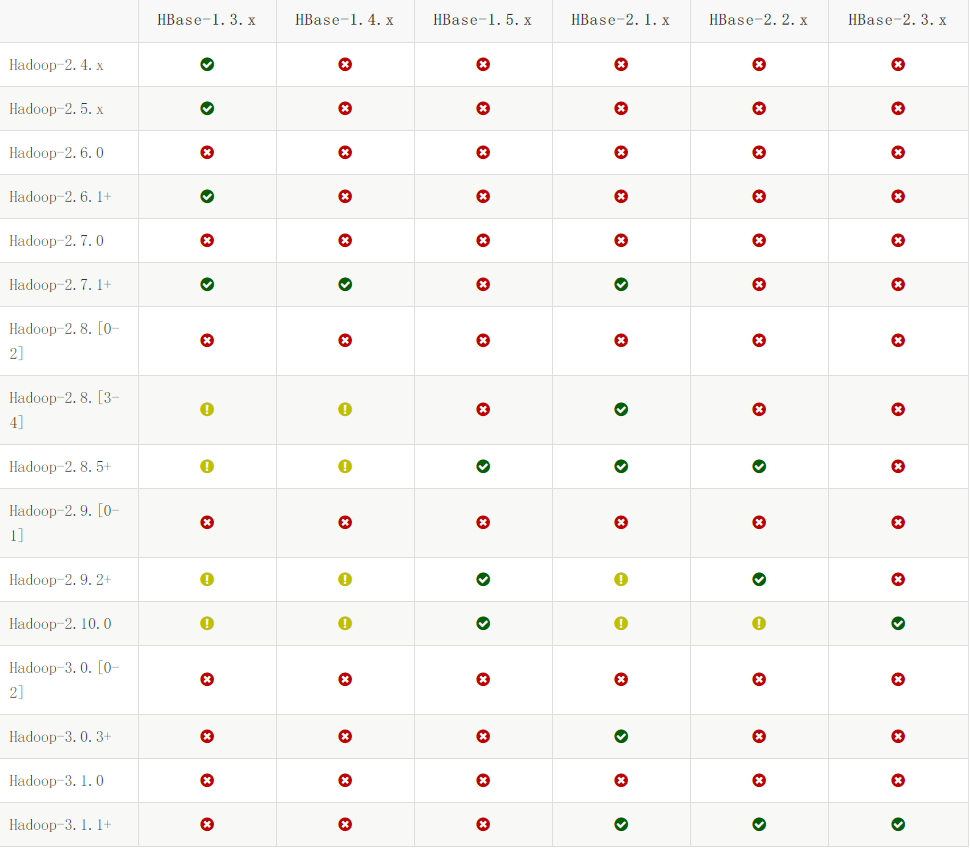

## 2. 配置主机

本次共用到3台主机

| 主机名 | 地址          | 职能                             |
| ------ | ------------- | -------------------------------- |
| hbase1 | 192.168.1.102 | hadoop、zookeeper、hbase的master |
| hbase2 | 192.168.1.103 | hadoop、zookeeper、hbase的slave  |
| hbase3 | 192.168.1.104 | hadoop、zookeeper、hbase的slave  |

配置三台主机:

- 更改主机名

  ```linux
  [root@hbase1 /]# vi /etc/hosts
  127.0.0.1   localhost localhost.localdomain localhost4 localhost4.localdomain4
  ::1         localhost localhost.localdomain localhost6 localhost6.localdomain6
  192.168.1.102 hbase1
  192.168.1.103 hbase2
  192.168.1.104 hbase3
  [root@hbase1 /]# vi /etc/hostname
  hbase1
  ```

  在三台中均做配置, hostname改成对应的主机名

- 配置免密登录

  ```linux
  [root@hbase1 /]# ssh-keygen -t rsa  #enter键一直敲到底
  [root@hbase1 /]# ssh-copy-id -i ~/.ssh/id_rsa.pub hbase2
  [root@hbase1 /]# ssh-copy-id -i ~/.ssh/id_rsa.pub hbase3
  ```

  在三台中均做配置,其中主机hbase1 要自己给自己一份不然后面启动hadoop会报Permission denied 

  ```linux
  [root@hbase1 /]# ssh-copy-id -i ~/.ssh/id_rsa.pub hbase1
  ```

  配置完之后可以ssh其它两台主机测试一下

## 3. 安装配置jdk 这里不再赘述

```linux
export JAVA_HOME=/opt/jdk1.8.0_231
export CLASSPATH=.:${JAVA_HOME}/jre/lib/rt.jar:${JAVA_HOME}/lib/dt.jar:${JAVA_HOME}/lib/tools.jar
export PATH=$PATH:${JAVA_HOME}/bin
```


## 4. 安装配置Hadoop

解压后需要更改如下几个配置:

- hadoop-env.sh

  ```linux
  export JAVA_HOME=/opt/jdk1.8.0_231
  export HDFS_NAMENODE_USER="root"
  export HDFS_DATANODE_USER="root"
  export HDFS_SECONDARYNAMENODE_USER="root"
  export YARN_RESOURCEMANAGER_USER="root"
  export YARN_NODEMANAGER_USER="root"
  ```

- core-site.xml

  ```linux
     <property>
          <name>hadoop.tmp.dir</name>
          <value>/opt/bigdata/hadoop/tmp</value>
          <description>Abase for other temporary directories.</description>
     </property>
     <property>
          <name>fs.default.name</name>
          <value>hdfs://hbase1:9000</value>
     </property>
  ```

-  hdfs-site.xml

  ```linux
  <!--默认50070-->
  	<property>
          <name>dfs.namenode.secondary.http-address</name>
          <value>hbase1:9001</value>
      </property>
  	<!--数据需要备份的数量，不能大于集群的机器数量，默认为3-->
      <property>
          <name>dfs.replication</name>
          <value>2</value>
      </property>
  	<property>
          <name>dfs.namenode.name.dir</name>
          <value>/opt/bigdata/hadoop/dfs/name</value>
      </property>
  	<property>
          <name>dfs.datanode.data.dir</name>
          <value>/opt/bigdata/hadoop/dfs/data</value>
      </property>
  	<property>
          <name>dfs.webhdfs.enabled</name>
          <value>true</value>
      </property>
  	<property>
           <name>dfs.permissions</name>
           <value>false</value>
      </property>
  
  ```

- workers

  ```linux
  hbase2
  hbase3
  ```

  注: 不需要yarn和MapReduce的话可以不需配置

  为了方便配置可以配置下环境变量:

  ```linux
  export HADOOP_HOME=/opt/hadoop-3.1.3
  export PATH=$PATH:$HADOOP_HOME/bin
  export PATH=$PATH:$HADOOP_HOME/sbin	
  ```

  创建上面用到的文件目录:

  /opt/bigdata/hadoop

  /opt/bigdata/hadoop/dfs

  /opt/bigdata/hadoop/tmp

  /opt/bigdata/hadoop/dfs/data

  /opt/bigdata/hadoop/dfs/name

分发到其它两台服务器:

```linux
[root@hbase1 /]# scp -r /opt/hadoop-3.1.3 hbase2:/opt/
[root@hbase1 /]# scp -r /opt/hadoop-3.1.3 hbase3:/opt/
[root@hbase1 /]# scp -r /opt/bigdata hbase2:/opt/
[root@hbase1 /]# scp -r /opt/bigdata hbase3:/opt/
```

启动hadoop:

- 格式化HDFS(只在master上执行, 第一次启动执行, 以后不许需要 除非恢复初始化)

  ```linux
  [root@hbase1 bin]# hadoop namenode -format
  ```

- 启动

  ```linux
  [root@hbase1 sbin]# ./start-all.sh
  ```

这时主机jps进程应为:

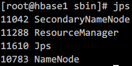

slave进程应为:

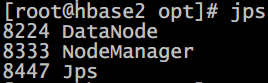

可以在http://192.168.1.102:9001查看数据节点情况:

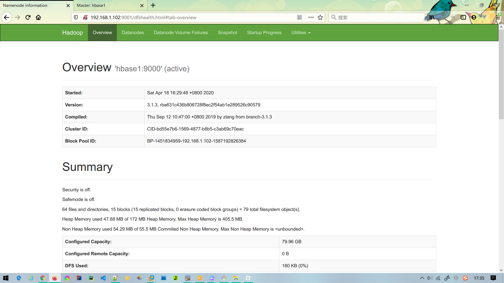

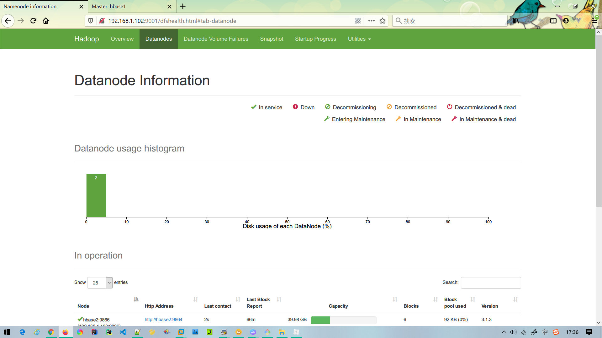


## 5. 安装配置Zookeeper

解压后复制一份conf中的zoo_sample.cfg 为 zoo.cfg

然后修改配置:

```linux
dataDir=/opt/bigdata/zkData

server.1=hbase1:2888:3888
server.2=hbase2:2888:3888
server.3=hbase3:2888:3888
```

创建所需的文件目录:

/opt/bigdata/zkData

然后在文件目录下新增myid文件 并在myid文件中写入值1(对应server编号)

分发zookeeper和所需数据文件目录到其它主机并修改相应的myid值

启动zookeeper:

```linux
[root@hbase1 bin]# ./zkServer.sh start
```

启动后master的jps进程为:

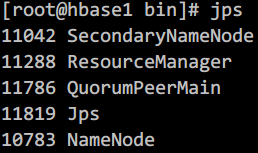

slave的jps进程为:

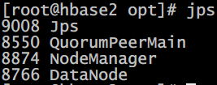


## 6. 安装配置Hbase

修改一下配置文件:

- hbase-env.sh

  ```linux
  export JAVA_HOME=/opt/jdk1.8.0_231
  export HBASE_MANAGES_ZK=false
  ```

- hbase-site.xml

  ```linux
     <property>
  		<name>hbase.master</name>
  		<value>hdfs://hbase1:60000</value>
     </property>
     <property>
  		<name>hbase.tmp.dir</name>
  		<value>/opt/bigdata/hbase/tmp</value>
     </property>
     <property>
          <name>hbase.rootdir</name>
          <value>hdfs://hbase1:9000/hbase</value>
      </property>
      <property>
          <name>hbase.cluster.distributed</name>
          <value>true</value>
      </property>
      <property>
          <name>hbase.zookeeper.quorum</name>
          <value>hbase1,hbase2,hbase3</value>
      </property> 
  	<property>
          <name>hbase.zookeeper.property.dataDir</name>
          <value>/opt/bigdata/zkData</value>
      </property>	
  	<property>
  		<name>hbase.zookeeper.property.clientPort</name>
  		<value>2181</value>
      </property>
  	<property>
  		<name>dfs.replication</name>
  		<value>1</value>
      </property>
      <property>
  		<name>hbase.unsafe.stream.capability.enforce</name>
  		<value>false</value>
      </property>
  ```

- regionservers

  ```linux
  hbase2
  hbase3
  ```

分发到其它两台机器

启动hbase

```linux
[root@hbase1 bin]# ./start-hbase.sh
```

此时master的jps进程应为:

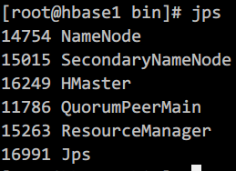

slave的jps进程应为:

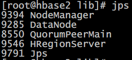

这里可能会看不到master中的HMaste,查看日志应该会看到报错:

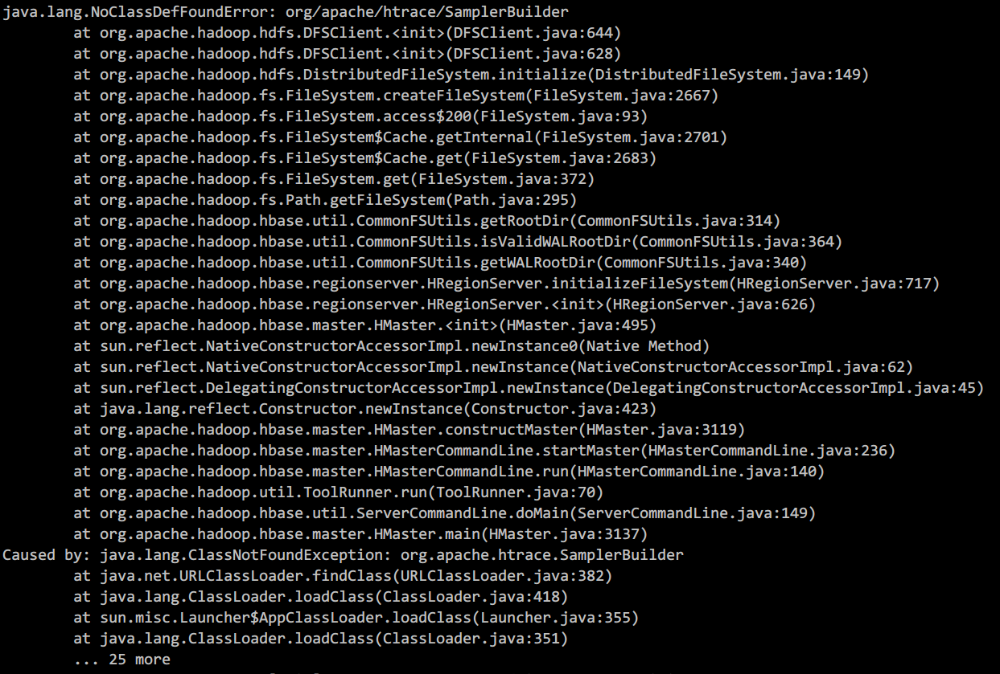

这是由于不同版本lib的关系

拷贝相应lib到lib文件夹下即可

```linux
[root@hbase1 hbase-2.1.10]# cp lib/client-facing-thirdparty/htrace-core-3.1.0-incubating.jar lib/
```

之后可以再http://192.168.1.102:16010查看管理页面

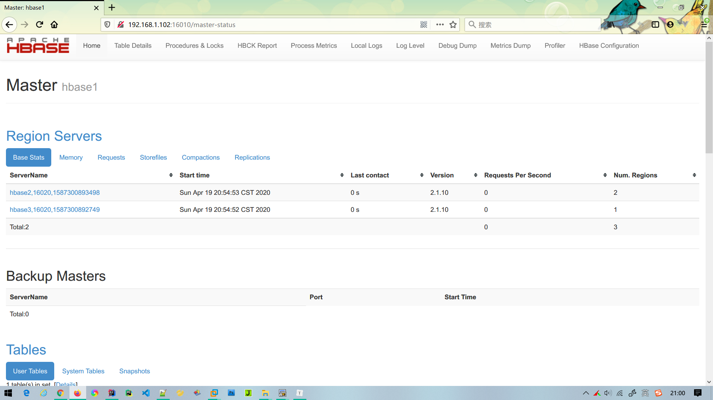